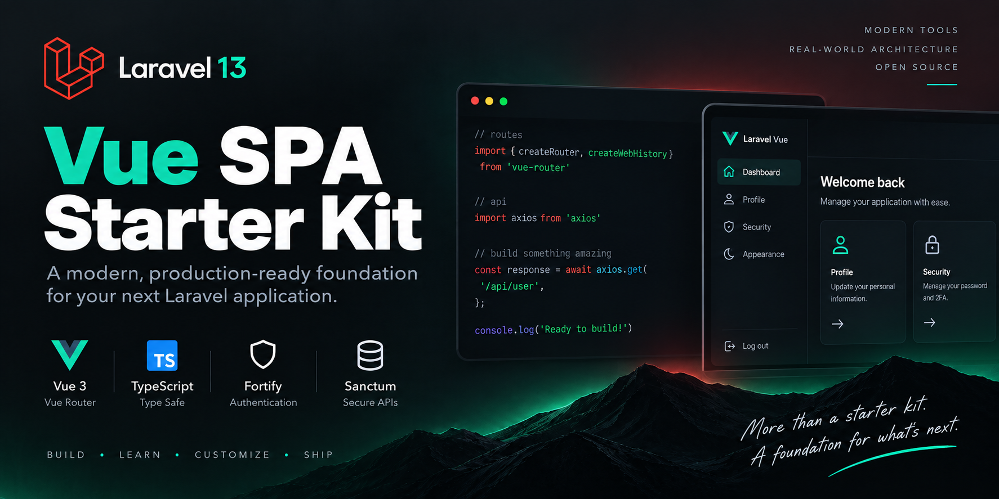

# Laravel Vue SPA Starter Kit

[](https://github.com/muradyanvano/laravel-vue-spa-starter-kit/actions/workflows/tests.yml)
[](https://packagist.org/packages/muradyanvano/laravel-vue-spa-starter-kit)
[](https://packagist.org/packages/muradyanvano/laravel-vue-spa-starter-kit)
[](https://www.php.net)
[](https://laravel.com)
[](LICENSE)

<p align="center">
    
</p>

A community Laravel starter kit for a first-party Vue SPA using Vue Router instead of Inertia.js.

This is **not** an official Laravel starter kit and is not endorsed by Laravel.

## Why this starter kit

Stack: **Laravel**, **Vue 3**, **TypeScript**, **Vue Router**, **Fortify**, **Sanctum**, **Wayfinder**, and **Vite**.

Architecture choice: a traditional same-origin SPA instead of Inertia.js.

```text
Laravel
  ├─ Fortify
  ├─ Sanctum
  ├─ API
  └─ Blade SPA shell
        ↓
      Vue 3
        ↓
    Vue Router
        ↓
      Axios
```

UI and developer experience are inspired by Laravel’s official Vue starter kit; the runtime is a conventional SPA with browser-owned routing.

## Quick Start

### Laravel Installer

```bash
laravel new my-app --using=muradyanvano/laravel-vue-spa-starter-kit
cd my-app
npm run dev
```

### Composer create-project

```bash
composer create-project muradyanvano/laravel-vue-spa-starter-kit my-app
cd my-app
npm run dev
```

Pin a specific release when you need an immutable install (for example `v1.1.0` or `v1.0.0`).

### Clone / source development

```bash
git clone https://github.com/muradyanvano/laravel-vue-spa-starter-kit.git
cd laravel-vue-spa-starter-kit
composer setup
npm run dev
```

### Requirements

- PHP 8.3+
- Composer
- Node.js 22+ (recommended; CI also covers Node 25)
- SQLite (default) or another supported database

The generated project is a normal Laravel application you own and can customize freely.

## Features

### Authentication

- Login / registration / logout
- **Passkey sign-in** (WebAuthn; requires a supported browser/platform)
- Password reset
- Email verification
- Password confirmation (password or passkey)
- Two-factor authentication (password login)
- Recovery codes

### Passkeys

- Sign in with a passkey from the login page (requires a WebAuthn-capable browser or platform)
- Confirm sensitive actions with a passkey on the confirm-password page
- Manage passkeys under **Settings → Security** (list, register, remove)
- Fortify and `@laravel/passkeys` handle WebAuthn ceremonies; Sanctum session cookies remain the SPA auth model
- Password login and password confirmation remain available alongside passkeys

### Application

- Responsive sidebar shell and mobile navigation
- Dashboard
- Profile settings (including account deletion)
- Security settings (password update, 2FA, and passkey management)
- Appearance settings (light / dark / system)

### Developer experience

- TypeScript
- Laravel Wayfinder
- Axios
- Tailwind CSS + shadcn-vue / Reka UI
- Pest, Vitest, PHPStan, Pint
- Optional Laravel Boost support

## Architecture

| Concern                | This kit                        |
| ---------------------- | ------------------------------- |
| Browser routing        | Vue Router                      |
| Auth capabilities      | Laravel Fortify                 |
| SPA session auth       | Sanctum stateful cookies + CSRF |
| HTTP client            | Axios                           |
| Typed routes / actions | Laravel Wayfinder               |
| Page shell             | Blade SPA shell + Vue           |
| Inertia                | Not used                        |

**Laravel** owns the API/backend, Fortify endpoints, Sanctum session authentication, and the SPA shell/fallback.

**Vue** owns browser routing, layouts/pages, authentication state, and API interaction.

Laravel serves the Blade SPA shell for browser routes such as `/dashboard` and `/settings/profile`. The catch-all does **not** swallow `/api/*`, `/sanctum/*`, `/up`, `/email/*`, `/storage/*`, Fortify endpoints, or public assets.

## Authentication and security

Default design: Laravel and the SPA share one origin (for example `https://example.com`).

- Sanctum cookie / session authentication (not JWT)
- CSRF protection via `/sanctum/csrf-cookie` and `X-XSRF-TOKEN`
- No auth tokens or WebAuthn credentials stored in `localStorage`
- Session regeneration on authentication events
- Password confirmation for sensitive actions (including passkey registration and removal)
- Email verification
- Two-factor authentication and recovery-code handling
- Passkey metadata API exposes safe fields only (`id`, `name`, `authenticator`, timestamps)

Split-origin deployments need correct `SANCTUM_STATEFUL_DOMAINS`, session cookie domain/SameSite, CORS, and CSRF configuration. That layout is out of scope for the default kit.

Useful variables: `APP_URL`, `SESSION_DOMAIN`, `SESSION_SECURE_COOKIE`, `SANCTUM_STATEFUL_DOMAINS`, `MAIL_*`.

Password reset and email verification use Laravel’s mailer. Configure `MAIL_*` (or a local driver such as log / Mailpit) before relying on those flows outside tests.

## Appearance

Appearance is client-driven (light / dark / system) via `localStorage` and an `appearance` cookie, matching the official-kit style settings experience.

## Development

From a generated app or a clone of this repository:

```bash
composer setup      # install deps, .env, key, migrate, build
composer dev        # concurrent PHP + Vite + queue/logs helpers
composer test       # Pint + PHPStan + Pest
composer ci:check   # frontend gates + Vitest + backend suite
```

Frontend:

```bash
npm run dev
npm run build
npm run test
npm run check
npm run types:check
npm run wayfinder:generate
```

Or run `php artisan serve` and `npm run dev` in separate terminals.

## Testing and quality

CI runs on pushes to `main` and `develop`, and on pull requests, including:

- Pest (PHP)
- Vitest (Vue)
- PHPStan
- TypeScript (`types:check`)
- Formatting / lint (`check`)
- Laravel Pint
- Production build verification
- Fresh git-archive consumer install checks
- Node.js **22** and **25** matrix coverage

Exact test counts belong in release notes; they change over time.

## Wayfinder

These directories are **generated** and gitignored:

- `resources/js/actions`
- `resources/js/routes`
- `resources/js/wayfinder`

Do not edit or commit them. `npm run build` / `npm run dev` generate them via `@laravel/vite-plugin-wayfinder`. `npm run types:check` also ensures they exist before `vue-tsc` runs.

On a completely fresh tree, run `composer setup` (or at least `npm run build` / `npm run types:check`) before expecting TypeScript imports from `@/routes` / `@/actions` to resolve.

## Laravel Boost

[`laravel/boost`](https://github.com/laravel/boost) is an optional development dependency for AI-assisted coding.

Boost setup is **not** mandatory. After creating an app, install Boost guidelines/skills only if you want them:

```bash
php artisan boost:install
```

The Laravel installer may also offer Boost during `laravel new`. Generated Boost state (`boost.json`, agent guideline files such as `AGENTS.md`) is gitignored and is **not** shipped to Packagist consumers. Composer lifecycle scripts do **not** run `boost:update` or `boost:install` automatically.

## Attribution

UI and developer experience inspired by Laravel’s official [Vue starter kit](https://github.com/laravel/vue-starter-kit).

This community project is independent of Laravel and is **not** an official starter kit maintained by Laravel. See [`NOTICE.md`](NOTICE.md) for third-party notices.

## Links

- [GitHub repository](https://github.com/muradyanvano/laravel-vue-spa-starter-kit)
- [Packagist package](https://packagist.org/packages/muradyanvano/laravel-vue-spa-starter-kit)
- [Contributing](CONTRIBUTING.md)
- [Security policy](SECURITY.md)
- [License](LICENSE)
- [Notice](NOTICE.md)
- [Laravel documentation](https://laravel.com/docs)
- [Vue documentation](https://vuejs.org)
- [Vue Router documentation](https://router.vuejs.org)

## License

MIT — see [`LICENSE`](LICENSE) and [`NOTICE.md`](NOTICE.md).
